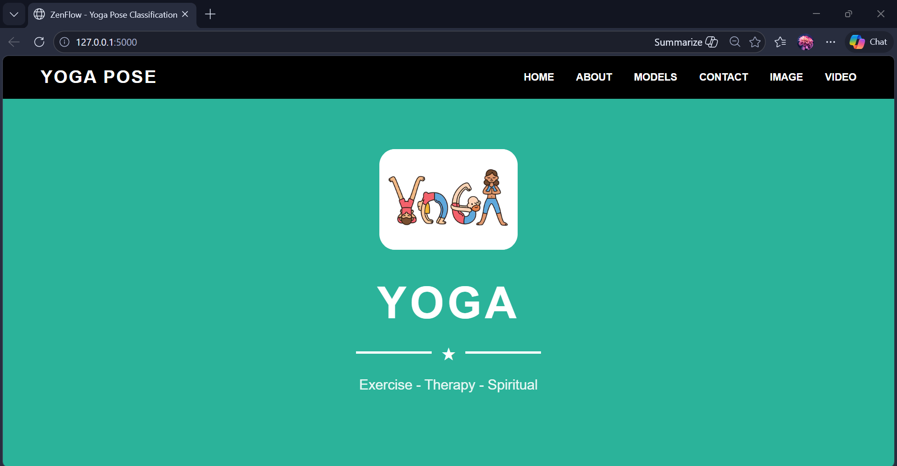
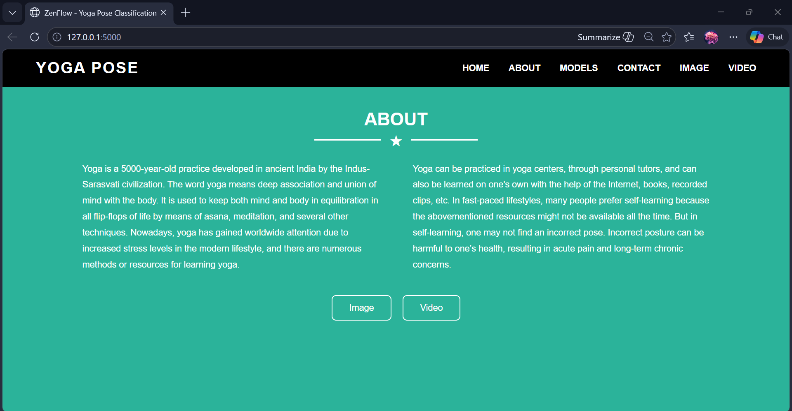
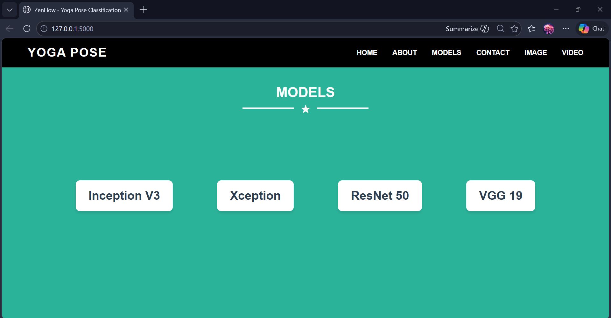
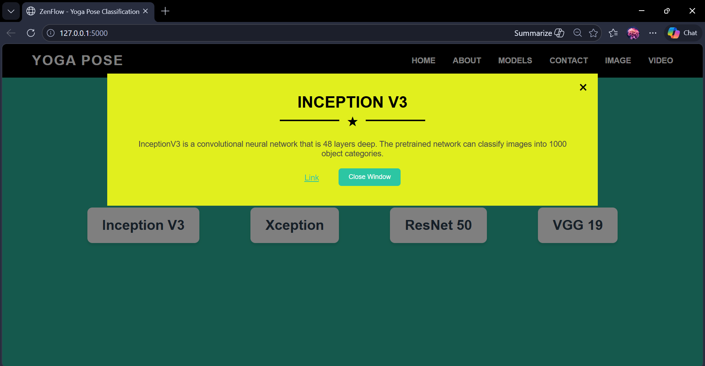
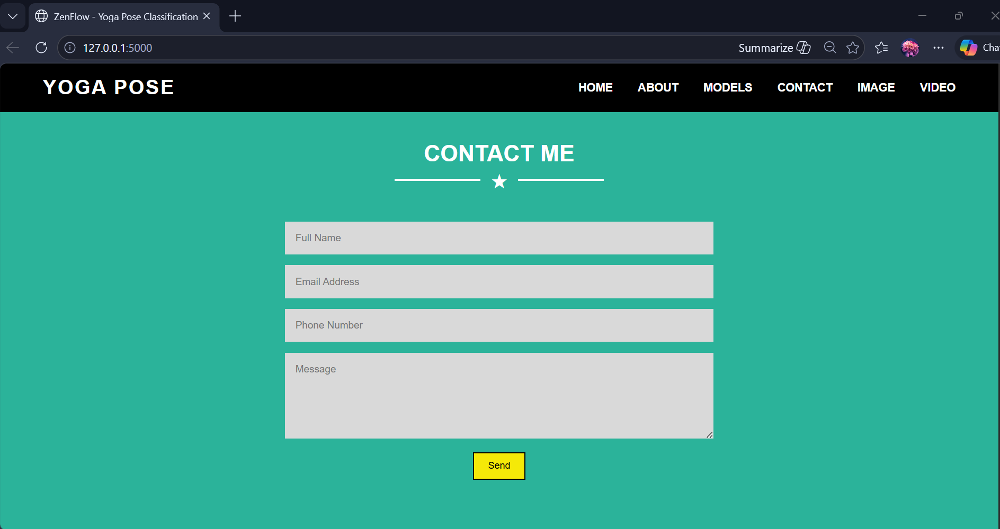
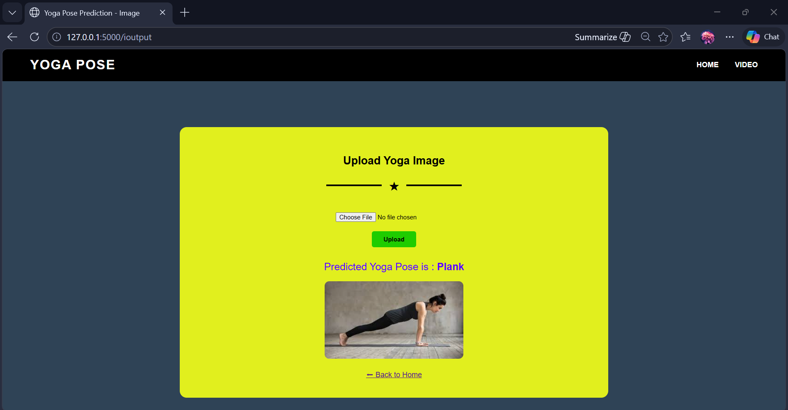
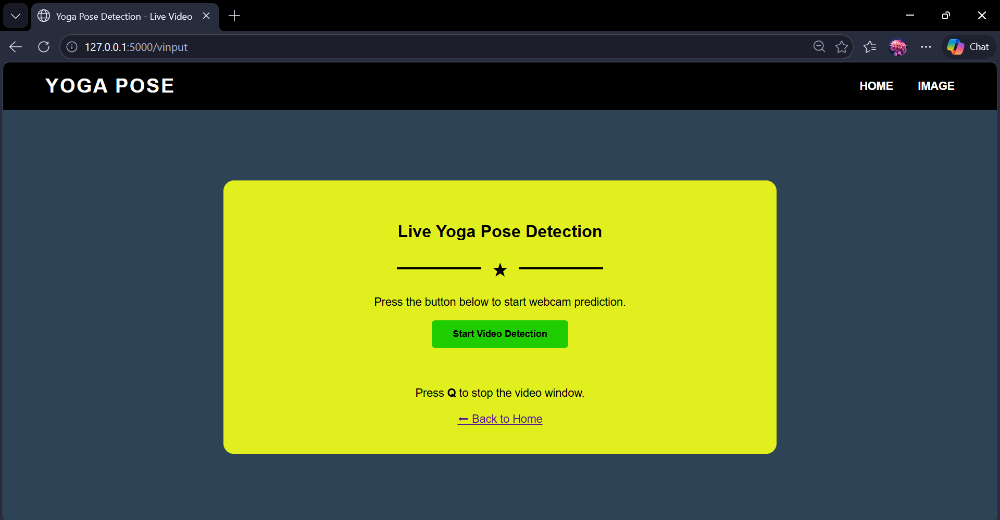

# 🧘 ZenFlow: Enlightened Yoga Pose Classification Via Transfer Learning

## 📌 Overview

**ZenFlow** is a deep learning–based web application designed to classify yoga poses from images and live webcam video.
Using **transfer learning with the Xception architecture**, the system analyzes body posture and predicts the yoga pose with high accuracy.

This project aims to assist **yoga practitioners, instructors, and researchers** by providing pose classification and feedback through an intuitive **Flask-based web interface**.

---

## 📽 Project Demonstration

Watch the full demo below to see how ZenFlow uses deep learning and transfer learning to classify yoga poses from images and live webcam input. The video demonstrates the web interface, and yoga pose prediction from image.

[](https://www.youtube.com/watch?v=cQk1olFn-aU)

---

## 📊 Dataset

The dataset consists of **images of 5 yoga poses**:

* Downdog
* Goddess
* Plank
* Tree
* Warrior2

📂 Dataset Link:
https://www.kaggle.com/datasets/ujjwalchowdhury/yoga-pose-classification

---

## 🖥 Web Application

The system is deployed using a **Flask web application**.

### 🌟 Features

* ✅ Image-based yoga pose prediction
* ✅ Live webcam pose detection
* ✅ Interactive UI with navigation sections
* ✅ Transfer learning model integration

---

## 🗂 Project Structure

```
ZenFlow-Enlightened-Yoga-Pose-Classification-Via-Transfer-Learning/
│
├── Dataset/                      # Dataset used for training the yoga pose model
│
├── Flask/                        # Flask web application
│   │
│   ├── static/                   # Static files for frontend
│   │   ├── assets/               # Images, icons, and other media files
│   │   ├── css/
│   │   │   └── style.css         # Stylesheets
│   │   └── js/
│   │       └── script.js         # JavaScript files
│   │
│   ├── templates/                # HTML templates for Flask
│   │   ├── index.html            # Home page
│   │   ├── input.html            # Page for uploading yoga pose image
│   │   └── output.html           # Displays prediction results
│   │
│   ├── app.py                    # Main Flask application file
│   └── xcep_yoga.h5              # Trained deep learning model
│
├── Training/                     # Model training files
│   └── Xception.ipynb            # Jupyter notebook for training the model
│
└── README.md                     # Project documentation
```

---

## 🚀 Installation & Setup

### 1️⃣ Clone the Repository

```bash
git clone https://github.com/ptrishita/ZenFlow-Enlightened-Yoga-Pose-Classification-Via-Transfer-Learning.git
cd ZenFlow-Enlightened-Yoga-Pose-Classification-Via-Transfer-Learning
```

---

### 2️⃣ Install Dependencies

```bash
pip install numpy tensorflow flask opencv-python pillow
```

---

### 3️⃣ Run the Flask Application

```bash
python app.py
```

Then open in browser:

```
http://127.0.0.1:5000/
```

---

## 📷 Image Prediction

1. Navigate to **Image Prediction**
2. Upload a yoga pose image
3. Model predicts pose among:

* Downdog
* Goddess
* Plank
* Tree
* Warrior2

---

## 🎥 Live Video Detection

1. Click **Video Detection**
2. Start webcam
3. Model predicts pose in real time
4. Press **Q** to stop detection

---

## 📸 Screenshots

### Home Page


### About Page


### Models Page


### Inception V3 Window


### Contact Page


### Yoga Pose Image Prediction Page


### Yoga Pose Video Detection Page


---

## 🛠 Technologies Used

| Technology         | Purpose                 |
| ------------------ | ----------------------- |
| Python             | Programming Language    |
| TensorFlow / Keras | Deep Learning           |
| Xception           | Transfer Learning Model |
| Flask              | Web Framework           |
| OpenCV             | Video Processing        |
| HTML/CSS/JS        | Frontend Interface      |

---

## 🧑‍🤝‍🧑 Use Case Scenarios

### 🧘 Scenario 1: Yoga Practitioners

* Helps practitioners refine their poses.
* Provides feedback on **pose accuracy and alignment**.
* Enhances overall yoga practice and benefits.

### 🧑‍🏫 Scenario 2: Yoga Instructors

* Integrate pose classification in **virtual yoga classes**.
* Provide **personalized feedback to students**.
* Improve teaching effectiveness and posture correction.

### 🔬 Scenario 3: Yoga Research

* Analyze yoga practice patterns.
* Study the effects of yoga on **physical and mental well-being**.
* Support **evidence-based yoga therapy research**.

---

## 🔮 Future Improvements

* Add **more yoga poses**
* Improve model accuracy using **larger datasets**
* Deploy application using **Docker / Cloud**
* Add **pose correction feedback**

---

## 📜 License

This project is developed as part of SmartInternz / SmartBridge internship and is for educational purposes only.

---

## 🙌 Acknowledgements

Dataset sourced from **Kaggle Yoga Pose Dataset**.

Transfer learning models inspired by **TensorFlow Keras Applications**.

---
